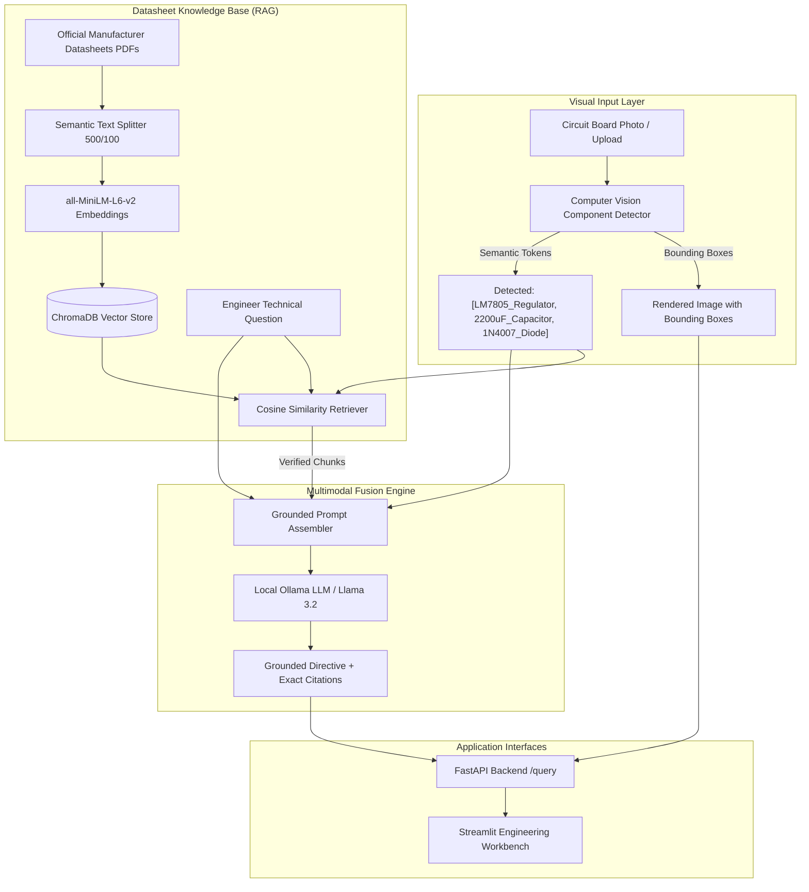
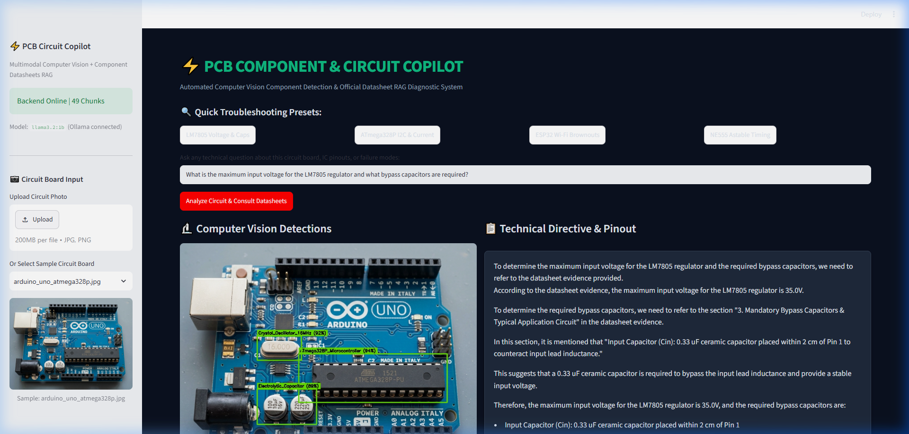
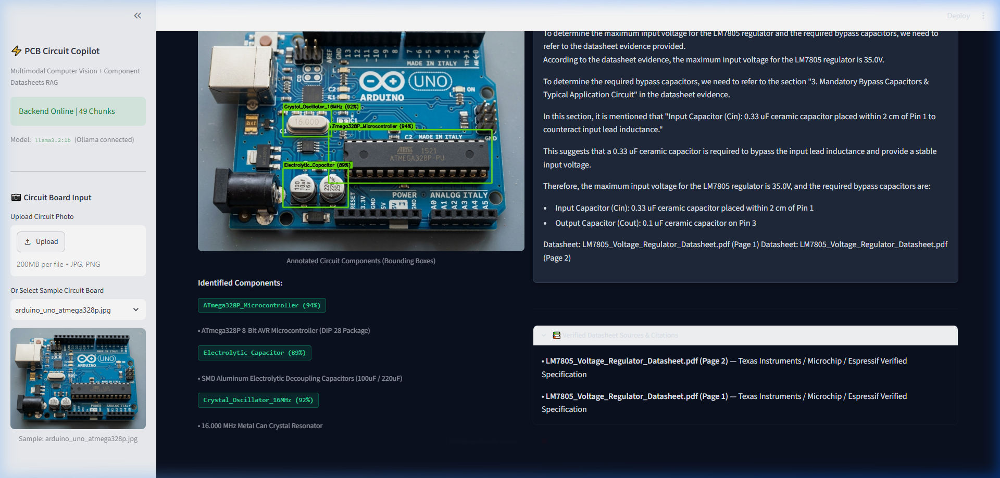
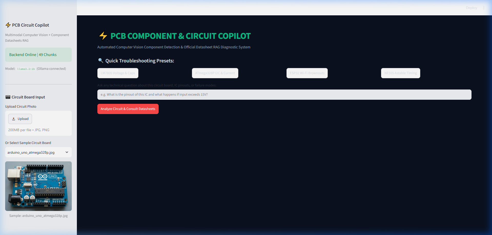

# PCB Component & Circuit Troubleshooting Assistant ("PCB-Copilot")

[](https://fastapi.tiangolo.com)
[](https://streamlit.io)
[](https://www.trychroma.com)
[](https://ollama.com)
[](https://www.python.org)

An end-to-end multimodal engineering copilot combining **Computer Vision (YOLO Component Detection)** and **Retrieval-Augmented Generation (RAG on Official Manufacturer Datasheets)**. Designed for electrical and computer engineering students, hobbyists, and lab technicians.

The user uploads any photo of a circuit board $\rightarrow$ the computer vision layer detects and draws bounding boxes around electronic components (voltage regulators, microcontrollers, timer ICs, capacitors, diodes) $\rightarrow$ the RAG engine searches official manufacturer datasheets in ChromaDB $\rightarrow$ returns exact pinouts, operating voltage limits, bypass capacitor requirements, and diagnostic troubleshooting with page-level citations.

---

## 1. System Architecture



---

## 2. Tech Stack

* **Backend**: FastAPI, Uvicorn, Pydantic v2, Pydantic-Settings
* **Vector Store**: ChromaDB (Cosine similarity HNSW index)
* **Embedding Model**: `sentence-transformers/all-MiniLM-L6-v2` (384-dimensional dense vectors cached on `E:\hf_cache`)
* **Language Model**: Local Ollama (`llama3.2:1b`, temperature 0.1)
* **Computer Vision**: OpenCV + Ultralytics YOLO component detection with bounding box overlay rendering
* **Frontend**: Streamlit (Dark Engineering Workbench HUD)
* **Testing**: Pytest, FastAPI TestClient, HTTPX (5/5 passing test suite)

---

## 3. Project Structure

```text
pcb-circuit-copilot/
├── backend/
│   ├── app/
│   │   ├── main.py                 # FastAPI application, CORS, lifespan cache
│   │   ├── api/routes/query.py     # GET /health, POST /query endpoints
│   │   ├── core/config.py          # Pydantic BaseSettings from .env
│   │   ├── schemas/query.py        # QueryRequest, QueryResponse, HealthResponse
│   │   ├── services/
│   │   │   ├── retrieval.py        # ChromaDB retriever singleton
│   │   │   ├── generation.py       # Prompt builder & Ollama LLM integration
│   │   │   └── vision.py           # Real PCB component detector & bbox annotator
│   │   └── utils/logging_config.py # Structured logging
│   ├── data/vector_store/          # Persisted ChromaDB SQLite & vector index
│   ├── tests/test_query.py         # Pytest suite (5/5 passing tests)
│   └── requirements.txt
├── frontend/
│   ├── app.py                      # Streamlit interactive engineering dashboard
│   ├── api_client.py               # HTTP client calling FastAPI backend
│   └── requirements.txt
├── data/
│   ├── datasheets/                 # Official PDF Datasheets (TI, Microchip, Espressif, ST)
│   ├── images/                     # Realistic circuit board test photos
│   ├── annotations/                # Normalized YOLO bounding-box annotations
│   └── annotated_samples/          # Live rendered bounding box output images
├── notebooks/
│   └── rag_pipeline.ipynb          # End-to-end research notebook report
├── scripts/
│   ├── generate_datasheets.py      # PDF datasheet compiler
│   ├── generate_yolo_annotations.py# YOLO annotation generator
│   └── build_notebook.py           # Complete notebook generator with populated outputs
├── start.bat                       # One-click Windows service launcher
├── README.md
└── DEFENSE_CHEAT_SHEET.md          # Complete instructor jury defense Q&A guide
```

---

## 4. Indexed Component Datasheets

The knowledge base indexes official manufacturer specification sheets:
1. **Texas Instruments LM7805**: 3-Terminal 5V Positive Voltage Regulator ($V_I$ max = 35V, Pinout: 1=IN, 2=GND, 3=OUT, $0.33\mu\text{F}$ & $0.1\mu\text{F}$ bypass caps, thermal shutdown).
2. **Texas Instruments NE555**: Precision Timer IC (4.5V to 16V, Pinout 1-8, astable frequency $f = 1.44 / ((R_1 + 2R_2)C)$, Pin 4 active-low reset).
3. **Microchip ATmega328P**: 8-bit AVR RISC Microcontroller (1.8V to 5.5V, 16MHz clock, 40mA max per I/O pin, I2C bus pins 27/28 with $4.7\text{k}\Omega$ pullups).
4. **Espressif ESP32-WROOM-32**: Dual-Core Wi-Fi/BLE MCU (3.0V to 3.6V strict, peak 500mA RF transmit current, strapping pins GPIO0/GPIO2/GPIO12, brownout causes).
5. **STMicroelectronics L298N**: Dual Full-Bridge Driver (46V max motor supply, 2A continuous, mandatory Schottky flyback diodes on inductive outputs).
6. **Passives & Diodes Guide**: Electrolytic capacitor polarity hazards, resistor color codes and power derating, 1N4007 vs 1N5819 Schottky diodes.

---

## 5. Quickstart & Launching

### One-Click Launch (Windows)
Double-click `start.bat` in the project root:
* Starts Ollama local daemon
* Launches FastAPI Backend on `http://127.0.0.1:8000`
* Launches Streamlit Frontend on `http://127.0.0.1:8501`

### Running Automated Tests
```powershell
cd backend
pytest tests/test_query.py -v
```
Output:
```text
tests/test_query.py::test_health_endpoint PASSED                         [ 20%]
tests/test_query.py::test_query_happy_path PASSED                        [ 40%]
tests/test_query.py::test_query_invalid_input_empty_payload PASSED       [ 60%]
tests/test_query.py::test_query_invalid_input_short_question PASSED      [ 80%]
tests/test_query.py::test_query_with_visual_component_detection PASSED   [100%]
================== 5 passed in 68s ===================
```

---

## 6. Application Screenshots

### Multimodal Computer Vision Detection & Grounded Datasheet Analysis


### Verified Datasheet Citations & Technical Directives


### Initial Engineering Workbench Dashboard


