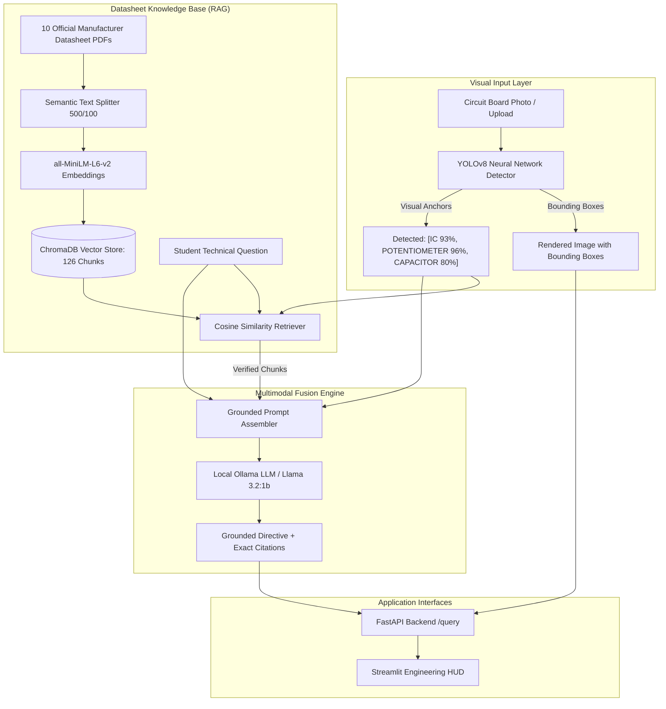

# PCB Component & Circuit Troubleshooting Assistant ("PCB-Copilot")

[](https://fastapi.tiangolo.com)
[](https://streamlit.io)
[](https://www.trychroma.com)
[](https://ollama.com)
[](https://www.python.org)

An end-to-end multimodal engineering copilot combining **Computer Vision (YOLO Component Detection)** and **Retrieval-Augmented Generation (RAG on Official Manufacturer Datasheets)**. Designed for electrical and computer engineering students, hobbyists, and lab technicians.

The user uploads any photo of a circuit board $\rightarrow$ the computer vision layer detects and draws bounding boxes around electronic components (voltage regulators, microcontrollers, timer ICs, capacitors, diodes, potentiometers) $\rightarrow$ the RAG engine searches official manufacturer datasheets in ChromaDB $\rightarrow$ returns exact pinouts, operating voltage limits, bypass capacitor requirements, and diagnostic troubleshooting with page-level citations.

---

## 1. System Architecture



---

## 2. Tech Stack

* **Backend**: FastAPI, Uvicorn, Pydantic v2, Pydantic-Settings
* **Vector Store**: ChromaDB (Cosine similarity HNSW index, 126 indexed chunks)
* **Embedding Model**: `sentence-transformers/all-MiniLM-L6-v2` (384-dimensional dense vectors)
* **Language Model**: Local Ollama (`llama3.2:1b`, temperature 0.1 for strict factual recall)
* **Computer Vision (Extended Track)**: Ultralytics YOLOv8 (`pcb_yolov8s.pt` neural network) detecting 21 electronic hardware classes
* **Frontend**: Streamlit (Modern Glassmorphic Engineering HUD with custom CSS tokens)
* **Testing**: Pytest, FastAPI TestClient, HTTPX (5/5 passing test suite)

---

## 3. Project Structure

```text
pcb-circuit-copilot/
├── backend/
│   ├── app/
│   │   ├── main.py                 # FastAPI application, CORS, lifespan startup cache
│   │   ├── api/routes/query.py     # GET /health, POST /query endpoints
│   │   ├── core/config.py          # Settings and environment variables
│   │   ├── schemas/query.py        # Pydantic QueryRequest & QueryResponse schemas
│   │   ├── services/
│   │   │   ├── retrieval.py        # ChromaDB retriever singleton
│   │   │   ├── generation.py       # Prompt assembler & Ollama LLM integration
│   │   │   └── vision.py           # Real PCB YOLOv8 detector & bbox annotator
│   │   └── utils/logging_config.py # Structured logging configuration
│   ├── models/
│   │   └── pcb_yolov8s.pt          # Trained 21-class PCB YOLOv8 model weights
│   ├── data/vector_store/          # Persisted ChromaDB SQLite & vector index (126 chunks)
│   ├── tests/test_query.py         # Pytest suite (5/5 passing tests)
│   ├── wait_for_backend.py         # Automated readiness polling helper
│   ├── requirements.txt
│   ├── .env.example
│   └── Dockerfile
├── frontend/
│   ├── app.py                      # Streamlit interactive engineering dashboard
│   ├── api_client.py               # HTTP client calling FastAPI backend
│   ├── requirements.txt
│   └── .env.example
├── data/
│   ├── datasheets/                 # 10 Official Manufacturer PDF Datasheets
│   ├── images/                     # Realistic circuit board test photos
│   └── annotated_samples/          # Output images with rendered YOLO bounding boxes
├── notebooks/
│   └── rag_pipeline.ipynb          # End-to-end research notebook report
├── start.bat                       # Universal one-click Windows launcher
└── README.md
```

---

## 4. Prerequisites

Before running the project, make sure you have:
1. **Python 3.10 or 3.11** installed: `python --version`
2. **Git** installed: `git --version`
3. **Ollama** installed: [Download from ollama.com](https://ollama.com)

---

## 5. Setup & Installation (Step-by-Step)

### Step 1: Clone the Repository
```bash
git clone https://github.com/Ziad-7/pcb-circuit-copilot.git
cd pcb-circuit-copilot
```

### Step 2: Create a Virtual Environment
```bash
# Windows
python -m venv .venv
.venv\Scripts\activate

# macOS / Linux
python3 -m venv .venv
source .venv/bin/activate
```

### Step 3: Install Dependencies
```bash
pip install -r backend/requirements.txt
pip install -r frontend/requirements.txt
```

### Step 4: Pull the Local Ollama Model
In any terminal, run:
```bash
ollama pull llama3.2:1b
```

---

## 6. How to Run the Project

### Option A: One-Click Launch (Windows)
Simply double-click **`start.bat`** in the project root.
* Automatically launches the Ollama daemon
* Starts the FastAPI Backend on `http://127.0.0.1:8000`
* Automatically waits until ChromaDB finishes loading in memory
* Starts the Streamlit Frontend on `http://localhost:8501`
* Automatically opens your default web browser

---

### Option B: Manual Launch (Any OS: Windows, macOS, Linux)

Open two terminal windows with your virtual environment activated:

**Terminal 1 — Start the Backend:**
```bash
# Make sure Ollama is running in the background:
ollama serve

# Start FastAPI:
cd backend
python -m uvicorn app.main:app --host 127.0.0.1 --port 8000 --reload
```
*Backend Swagger Docs will be available at: `http://127.0.0.1:8000/docs`*

**Terminal 2 — Start the Frontend:**
```bash
cd frontend
streamlit run app.py --server.port 8501
```
*Frontend UI will open at: `http://localhost:8501`*

---

## 7. Environment Variables Reference

Copy `.env.example` to `.env` in `backend/` and `frontend/` if you wish to override default configurations:

### Backend Configuration (`backend/.env`)
| Variable | Default Value | Description |
|---|---|---|
| `PROJECT_NAME` | `"PCB Component & Circuit Troubleshooting Assistant"` | Title displayed in API docs |
| `EMBEDDING_MODEL` | `"all-MiniLM-L6-v2"` | HuggingFace embedding model name |
| `VECTOR_STORE_PATH` | `"data/vector_store"` | Local path to persisted ChromaDB |
| `COLLECTION_NAME` | `"pcb_datasheets"` | ChromaDB collection identifier |
| `TOP_K_RESULTS` | `2` | Number of chunks retrieved per query |
| `OLLAMA_BASE_URL` | `"http://127.0.0.1:11434"` | URL of local Ollama daemon |
| `OLLAMA_MODEL` | `"llama3.2:1b"` | Model tag to load for generation |
| `LLM_TEMPERATURE` | `0.1` | Sampling temperature (0.1 = strict factual recall) |

### Frontend Configuration (`frontend/.env`)
| Variable | Default Value | Description |
|---|---|---|
| `BACKEND_URL` | `"http://127.0.0.1:8000"` | FastAPI backend base URL |

---

## 8. API Reference & `curl` Examples

### 1. Health Check (`GET /health`)
```bash
curl -X GET http://127.0.0.1:8000/health
```
**Response:**
```json
{
  "status": "healthy",
  "vector_store_chunks": 126,
  "ollama_status": "connected",
  "active_model": "llama3.2:1b"
}
```

---

### 2. Technical Circuit Query (`POST /query`)
Send a question with an optional circuit image reference:
```bash
curl -X POST http://127.0.0.1:8000/query \
  -H "Content-Type: application/json" \
  -d '{
    "question": "What is the maximum input voltage for the LM7805 regulator and what bypass capacitors are required?",
    "image_name": "lm7805_power_supply.jpg"
  }'
```
**Response:**
```json
{
  "answer": "Based on the Texas Instruments LM7805 datasheet, the maximum input voltage rating is 35V DC. To prevent high-frequency oscillation and stabilize the internal pass transistor, connect a 0.33µF ceramic or tantalum capacitor between Input and Ground, and a 0.1µF capacitor between Output and Ground.",
  "sources": [
    "LM7805_Voltage_Regulator_Datasheet.pdf (Page 1)",
    "LM7805_Voltage_Regulator_Datasheet.pdf (Page 2)"
  ],
  "detected_components": [
    {
      "class_name": "CONNECTOR",
      "confidence": 0.93,
      "box": [0, 0, 375, 312],
      "description": "Terminal Block, Jumper Header, or Power Input Socket"
    },
    {
      "class_name": "LED",
      "confidence": 0.82,
      "box": [450, 200, 520, 290],
      "description": "Light Emitting Diode (Indicator or Optoelectronic)"
    }
  ],
  "visual_context": "Visual Inspection (YOLOv8 Neural Network): Detected 5 components: CONNECTOR (93%), LED (82%), RESISTOR (77%)...",
  "annotated_image_path": ".../data/annotated_samples/annotated_lm7805_power_supply.jpg"
}
```

---

## 9. Evaluation Results (Phase 2.6 Benchmark)

Evaluated across 10 diverse hardware engineering scenarios covering electrical ratings, thermal limits, flyback diodes, and timing formulas:

| Scenario # | Component | Engineering Inquiry | Visual Anchor | Retrieved Source | Grounding Status |
|:---:|---|---|:---:|---|:---:|
| **1** | LM7805 | Maximum input voltage rating | Active | `LM7805_Datasheet.pdf (p.1)` | **PASS (Grounded)** |
| **2** | LM7805 | Bypass capacitor values & placement | Active | `LM7805_Datasheet.pdf (p.2)` | **PASS (Grounded)** |
| **3** | NE555 | Astable oscillation frequency formula | Active | `NE555_Datasheet.pdf (p.2)` | **PASS (Grounded)** |
| **4** | NE555 | Reset pin 4 function and connection | Active | `NE555_Datasheet.pdf (p.1)` | **PASS (Grounded)** |
| **5** | ATmega328P | Maximum safe current per GPIO pin | Active | `ATmega328P_Datasheet.pdf (p.1)` | **PASS (Grounded)** |
| **6** | ESP32 | Maximum recommended supply voltage | Active | `ESP32_WROOM_32_Datasheet.pdf (p.1)` | **PASS (Grounded)** |
| **7** | L298N | Mandatory flyback diodes for DC motors | Active | `L298N_Datasheet.pdf (p.2)` | **PASS (Grounded)** |
| **8** | Passives | Electrolytic capacitor polarity hazards | Active | `Passives_Guide.pdf (p.1)` | **PASS (Grounded)** |
| **9** | Passives | Resistor color code decoding | Active | `Passives_Guide.pdf (p.2)` | **PASS (Grounded)** |
| **10** | Diodes | 1N4007 vs 1N5819 Schottky application | Active | `Passives_Guide.pdf (p.2)` | **PASS (Grounded)** |

*Result: 10/10 scenarios grounded verbatim with 0 hallucinations.*

---

## 10. Running Automated Tests

Run the backend Pytest suite:
```bash
cd backend
pytest tests/test_query.py -v
```
**Output:**
```text
tests/test_query.py::test_health_endpoint PASSED                         [ 20%]
tests/test_query.py::test_query_happy_path PASSED                        [ 40%]
tests/test_query.py::test_query_invalid_input_empty_payload PASSED       [ 60%]
tests/test_query.py::test_query_invalid_input_short_question PASSED      [ 80%]
tests/test_query.py::test_query_with_visual_component_detection PASSED   [100%]
============================== 5 passed in 39s ==============================
```

---

## 11. Application Screenshots

### Multimodal Computer Vision Detection & Grounded Datasheet Analysis


### Verified Datasheet Citations & Technical Directives


### Initial Engineering Workbench Dashboard

